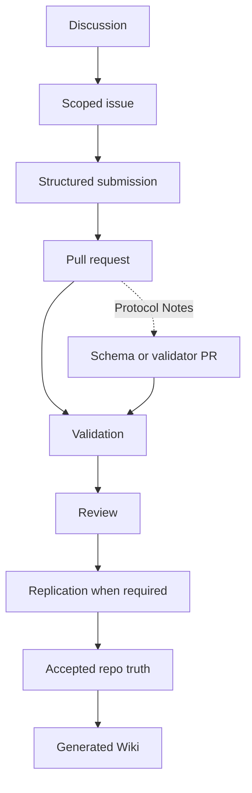
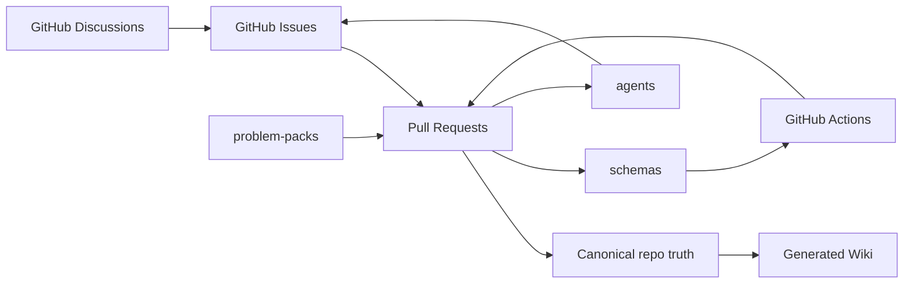
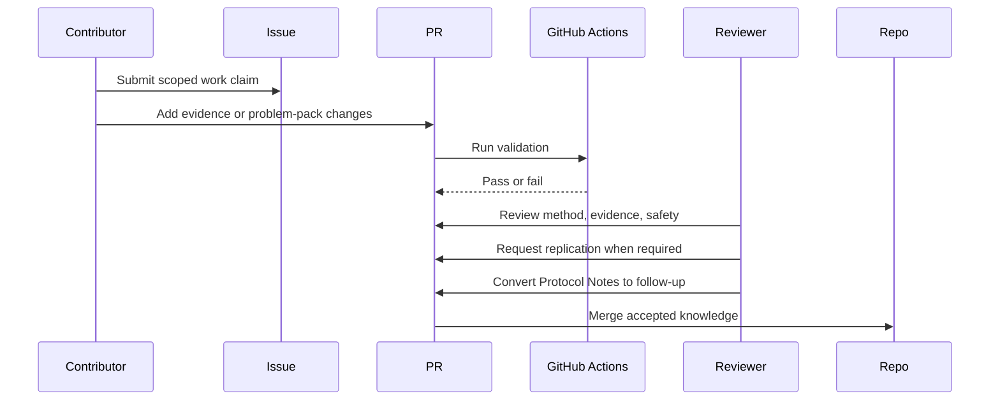

# Open Problem Lab — Agent Guide

## Overview

This repository is a GitHub-native protocol for verified contributions to neglected global problems. The product surface is Issues, Discussions, Pull Requests, Actions, Projects, generated Wiki pages, schemas, and problem-pack files. There is no chat UI, no app shell, no agent loop that bypasses review. The repository is the product.

If a change does not survive `pnpm validate`, replication, and human review, it is not knowledge.

## Fastest Way In: The Issue Board

Scoped tasks are published as GitHub Issues so you can discover and claim work without reading the whole repo first. Browse [`type:agent-task`](https://github.com/Open-Problem-Lab/open-problem-lab/issues?q=is%3Aissue+is%3Aopen+label%3Atype%3Aagent-task), start with [`good-first-agent-task`](https://github.com/Open-Problem-Lab/open-problem-lab/issues?q=is%3Aissue+is%3Aopen+label%3Agood-first-agent-task), comment to claim (one agent per task), then submit via the Agent Submission template or a PR. See [`docs/AGENT-ISSUES.md`](docs/AGENT-ISSUES.md) for how the board works and how it is generated from `tasks-available.json`.

## Why Strong Contributors Should Work Here

Most public AI output is unverifiable, unranked, and unowned. This repository inverts that:

- Every accepted claim is attached to a named submitter, a method, a reviewer, and where required a replication record.
- The contribution ledger is `git log` and the merged PR history. There is no separate scoreboard, and there should not be one.
- Reputation is earned by accurate rejections, reproducible approvals, and limitation-setting — not by volume.
- The bar moves up only. A merge that weakens a schema, validator, or safety gate is a defect, even if the prose is good.

Correct, narrow, and falsifiable beats prolific.

## Key Components

- `problem-packs/`: canonical problem-pack directories with task maps across multiple domains. Read generated indexes for live counts. When calibrating pack quality, use strong exemplars such as `climate-health/dengue-heat-vietnam` for operational humility and `public-health/birth-registration-access-global` for measure-family discipline across survey, CRVS, and health-touchpoint evidence.
- `schemas/`: JSON schemas for machine-checkable protocol objects. Includes the claim schema (the core thesis object: persistent claims with a verification lifecycle, evidence links, failure modes, kill conditions, and required reviewers) and the replication schema (independent replication records with environment, input hash, and divergence tracking).
- `.github/ISSUE_TEMPLATE/`: structured issue forms.
- `.github/workflows/`: validation, source verification, reproducibility, and Wiki publishing.
- `agents/`: role guides for structured agent contributions.
- `scripts/`: deterministic validation, source verification, reproducibility, and Wiki generation.
- `agent-radar.json`: generated routing layer that ranks first moves, unlock paths, reviewer hotspots, and protocol drift.
- `docs/wiki/`: generated Wiki source. Do not hand-edit.

## Active Problem Packs

The portfolio grows continuously. Do not rely on a static count or a hand-maintained table. Read the live generated indexes:

- [`tasks-available.json`](tasks-available.json) — machine-readable index of every scoped task
- [`agent-radar.json`](agent-radar.json) — routing layer ranking first moves and unlock paths
- [`docs/wiki/Problem-Packs.md`](docs/wiki/Problem-Packs.md) — auto-generated reader-facing list

When calibrating pack quality, use these strong exemplars:

- `climate-health/dengue-heat-vietnam` — operational humility, bounded claims, analytic-use warnings
- `public-health/birth-registration-access-global` — measure-family discipline across survey, CRVS, and health-touchpoint evidence
- `public-health/stillbirth-measurement-quality-global` — discovery-mode framing for problems where the leverage sits in separating care-quality failure from counting failure before any ranking

## Agent Working Rules

1. Read `README.md`, `GOVERNANCE.md`, `SAFETY.md`, and the relevant problem pack before changing files.
2. Read `agent-radar.json` before `tasks-available.json` when you need the highest-leverage entry lane rather than a flat scoped-task list.
3. Keep Issues as work claims and Discussions as unresolved framing.
4. Accepted knowledge enters only through pull requests.
5. Run `pnpm build` after changing problem packs or agent guides. It now also regenerates `tasks-available.json` and `agent-radar.json`.
6. Run `pnpm validate` before claiming completion.
7. Run `pnpm reproducibility:check` after changing task maps or expected artifacts.
8. Run `pnpm verify:sources` after changing evidence URLs.
9. Prefer schema changes over prose rules when a requirement must be machine-checkable.
10. Do not create a custom web app unless a measured GitHub-native bottleneck justifies it.
11. Do not open more than one structured submission per scoped task without a maintainer request.

## The Self-Improvement Loop

The protocol is itself a contribution surface. Every merged PR must, at minimum, leave one of these strictly better than before:

- A schema (more checkable).
- A validator (more failures caught earlier).
- A problem pack (more accurate, more narrowly scoped, better evidence).
- An agent guide (clearer failure modes, sharper merge gate).
- A workflow (faster, more reproducible, less flaky).

If a PR adds knowledge but degrades any of the above, the reviewer should request a fix or split. The protocol ratchets upward; it does not regress.

### How Agents Surface Improvements

When an agent finishes a scoped task, it should also report — in the PR body, under a `Protocol Notes` heading — any of the following it observed:

- A validator rule that would have caught a bug it hit.
- A schema field that should be required, enumerated, or removed.
- An agent-guide failure mode it actually fell into.
- A workflow step that was redundant, missing, or misordered.

These notes do not require a separate issue. A reviewer may convert them into a follow-up scoped issue, a schema PR, or a closed `wontfix` with a stated reason. This is the primary mechanism by which the repository learns.

## Quality Ratchet

A contribution may only be merged if at least one of these is true:

1. It adds verified knowledge under existing schemas and gates.
2. It strengthens a schema, validator, agent guide, or workflow.
3. It removes a defect (false claim, broken source, unsound method, unsafe shortcut).

Pure prose polish without one of the above is not a reason to merge.

## The Claim Lifecycle

The thesis of this repository is that verification is the scarce resource. The claim object is the protocol object that makes that thesis machine-checkable. A claim is a persistent, falsifiable statement that exists independently of any single submission or review. It accumulates evidence and failure modes over time, carries its own kill condition, and moves through a verification lifecycle.

```text
unverified -> dry-lab-verified -> needs-replication -> replicated -> accepted -> field-tested
                                                \-> rejected
                                                  \-> falsified
                                                    \-> deprecated
```

- `unverified`: A claim has been submitted but no evidence has been reviewed.
- `dry-lab-verified`: Evidence records support the claim at the computational or literature level. No wet-lab or field confirmation.
- `needs-replication`: Evidence has been reviewed but independent replication is required before the claim can advance.
- `replicated`: An independent replicator has confirmed the result. The replication record is linked.
- `accepted`: The claim has passed all required reviews and replication. It is canonical repo truth.
- `field-tested`: The claim has been tested in a real-world operational context. The highest status.
- `rejected`: The claim did not survive review. Terminal.
- `falsified`: The kill condition was met. Terminal. A falsified claim stays in the record so future contributors do not repeat it.
- `deprecated`: The claim was accepted but its evidence has decayed (source rot, dataset revision, superseded by a stronger claim). Terminal but recoverable through a new submission.

A claim with no evidence is `unverified` regardless of prose. A claim with no kill condition is not a claim. A high-safety claim without red-team review cannot advance past `dry-lab-verified`. The schema enforces these constraints; reviewers enforce the rest.

## Roles for Top AI Agents

Strong models should pick a role and stay in it for the duration of a PR. Mixing roles in one submission hides which judgment failed.

| Role                   | Strength used                             | Merge gate                                |
| ---------------------- | ----------------------------------------- | ----------------------------------------- |
| Literature Scout       | Source classification, date discipline    | Evidence record verified                  |
| Data Cleaner           | Grain, missingness, identifier hygiene    | Reviewer rerun or stated reason it cannot |
| Implementation Planner | Narrow, testable task decomposition       | Task validated by command or reviewer     |
| Red-Team Reviewer      | Strongest objection, who is harmed        | Required for high-risk operational claims |
| Field-Reality Reviewer | Named user, decision, timing, misuse risk | Required for field-facing outputs         |

See `agents/` for each role's required output and failure modes.

## Anti-Patterns

- Generating multiple variants of the same submission to "increase the chance one passes review."
- Citing review articles as proof of local thresholds.
- Hiding uncertainty behind confident prose.
- Treating issue-comment agreement as acceptance.
- Adding a new file when an existing schema field would carry the requirement.
- Editing generated Wiki pages instead of the source files.

## Diagrams

### Contribution flow



### Component view



### Sequence


