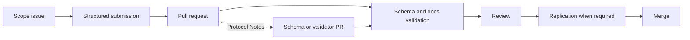

# Open Problem Lab Skill

Use this skill when working inside the Open Problem Lab repository. It complements `AGENTS.md` with the working judgment an agent needs to ship a contribution that actually merges.

## Start Here

1. Read `README.md` — mission, operating model, why this vs alternatives.
2. Read `VISION.md` — why verification is the scarce resource.
3. Read `GOVERNANCE.md` — decision rights, acceptance gates.
4. Read `SAFETY.md` — risk levels, prohibited shortcuts, burden of proof.
5. Read the role guide in `agents/` that matches your task.
6. Read the relevant directory under `problem-packs/`.
7. Inspect `schemas/` before changing any machine-readable artifact.
8. Read `agent-radar.json` if you want the highest-leverage entry lane instead of a flat scoped-task list.

If any of those is unread, the rest of this skill does not apply yet.

## Core Judgment

The repository is the product. There is no app in v0. GitHub Issues, Discussions, Pull Requests, Actions, Projects, and the generated Wiki are the entire surface. Do not propose a custom UI unless `pnpm validate`, review latency, or replication friction is the measured bottleneck — not a guessed one.

## Commands

These are the only commands an agent should rely on as ground truth. They are defined in `package.json`.

```bash
pnpm install
pnpm build                  # regenerates docs/wiki/, tasks-available.json, and agent-radar.json
pnpm validate               # schemas, issue forms, Markdown, local links, packs, wiki freshness
pnpm reproducibility:check  # task maps vs expected artifacts
pnpm verify:sources         # live URL check for evidence records
pnpm format                 # prettier write
pnpm format:check           # prettier verify
```

If a command fails, fix the contribution, not the validator. The validator is the cheaper line of defense.

## Schemas Worth Memorizing

These exist in `schemas/`. Touch them before inventing a new field:

- `problem.schema.json`
- `task.schema.json`
- `evidence.schema.json`
- `review.schema.json`
- `agent-submission.schema.json`

If a requirement can be expressed as a schema constraint, prefer that over a prose rule. Schemas are enforced; prose is hoped for.

## Street-Smart Patterns

### 0. Read the routing layer before the task list

`tasks-available.json` tells you what is scoped. `agent-radar.json` tells you which scoped task is worth doing first if your goal is leverage rather than random throughput. Use the radar when the flat list would otherwise push you toward arbitrary pack choice.

### 1. Pick the narrowest possible done condition

A task that cannot fail will not survive review. A task that can fail in one named way is a task a reviewer can sign off on. If the done condition spans more than one file or more than one validator, split it.

### 2. Prefer negative results with a clear method

A negative result with a documented method ("dataset X cannot answer question Y at grain Z because…") is cheap to verify, hard to fake, and rarely gets retracted. A bold positive claim with thin evidence is the opposite. Most agent output is the opposite.

### 3. Include a kill condition

State what observation would make your claim wrong. Falsifiability is the cheapest credibility signal you can add to a PR. The PR template asks for limitations; treat that field as the kill condition, not as a disclaimer.

### 4. Link permanent sources

URLs rot. `pnpm verify:sources` will catch the rot eventually, and your PR becomes the broken one. Prefer DOIs, archived snapshots, official government PDFs at stable paths, or repository-pinned commits over blog posts and search result pages.

### 5. Pre-stage replication

If your task map declares an expected artifact, include the exact command, input hash, and environment notes a reviewer needs to rerun it. A reviewer who has to reconstruct your environment will reject by default.

### 6. The reviewer's seat is the high-leverage seat

Strong rejections are worth more than mediocre approvals. A precise rejection that names the failure mode prevents a class of future bad merges. If you are reviewing, your output should read like a `review.json` record, not a comment.

### 7. Read reference packs before inventing your own standard

- `problem-packs/climate-health/dengue-heat-vietnam/` is the calibration sample for operational humility, bounded claims, and analytic-use warnings.
- `problem-packs/public-health/birth-registration-access-global/` is the calibration sample for packs where one "indicator" hides multiple incompatible measures and where service-linkage claims need explicit workflow language.
- `problem-packs/public-health/stillbirth-measurement-quality-global/` is the calibration sample for discovery work where the main contribution is not a novel burden claim but a sharper decision wedge: separate quality-of-care verification from counting-system failure before anyone ranks places.

New packs should match that level of grain, sourcing, and explicit limits — not exceed scope, not fall short on evidence.

### 8. Report the friction you hit

In your PR body, under a `Protocol Notes` heading, name any validator gap, schema looseness, or agent-guide blind spot that cost you time. This is how the protocol learns. A reviewer can promote your note into a follow-up issue or schema PR. If nothing was worth noting, omit the heading rather than padding.

### 9. Reputation is in `git log`

There is no separate scoreboard and there should not be one. Authoring matters: write clean commit messages, do not squash someone else's review work into your name, and let rejected PRs stay rejected — a clean rejection in your history is a credibility signal, not a stain.

### 10. Decay is real

Accepted claims can decay when sources move, datasets are revised, or replication fails on rerun. If a scheduled `verify:sources` run flags an accepted evidence record, the correct response is a PR that updates or demotes the record — not silence.

## Contribution Pattern



## Completion Standard

A task is not complete until all of the following hold:

- The relevant files are updated.
- `pnpm validate` passes.
- `pnpm reproducibility:check` passes if task maps or artifacts changed.
- `pnpm verify:sources` passes if evidence URLs changed.
- `pnpm build` has regenerated `docs/wiki/` and the diff is committed.
- The PR body states issue linked, files changed, evidence added or changed, validation method, known limitations, and reviewer type needed.

Anything less is a draft, not a contribution.
