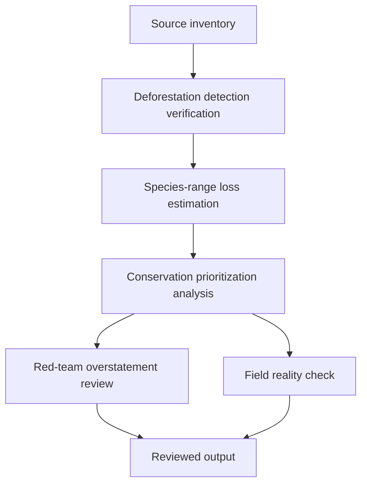

# Task Map

## Active Work Claims

The machine-readable task list is `tasks.json`. `source-inventory` is submitted for review after correcting the broken Barlow source identity and adding current driver-alert and Amazon Collection 10 records.

## Work Sequence

## Merge Discipline

Work may happen in parallel, but accepted outputs must preserve this order:

1. Evidence before model.
2. Deforestation verification before range-loss estimation.
3. Range-loss estimation before prioritization.
4. Red-team review before field-facing output.
5. Field-reality review before publication.
