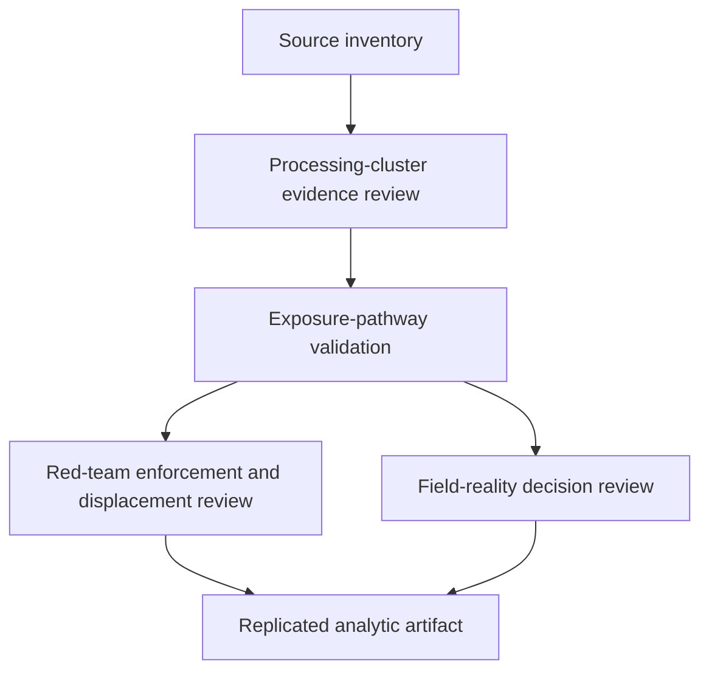

# Task Map

## Active Work Claims

The machine-readable task list is `tasks.json`.

## Work Sequence

## Merge Discipline

1. Evidence before mapping.
2. Activity identification before exposure inference.
3. Measurement before allocation recommendation.
4. Red-team and field-reality review before publication.
