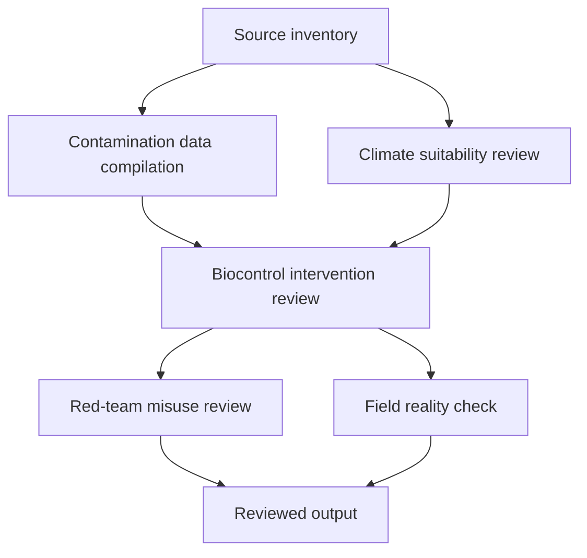
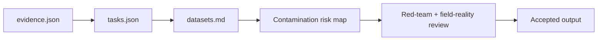
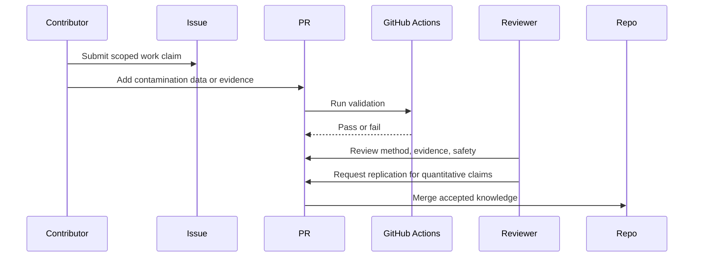

# Aflatoxin Exposure From Contaminated Staple Grains In Sub-Saharan Africa

## Overview

This problem pack addresses the geographic evidence gap for aflatoxin contamination of staple grains in sub-Saharan Africa. Aflatoxin B1 is an IARC Group 1 carcinogen contaminating the maize and groundnuts that feed hundreds of millions. No sub-national exposure map exists for any SSA country. The pack builds toward a verified district-level contamination risk artifact that could change where post-harvest drying, biocontrol, and surveillance testing are deployed.

## Key Components

- `problem.json`: pack metadata, safety level (high), review policy
- `problem.md`: problem statement, known facts, uncertain areas, scope
- `evidence.json`: five verified evidence records (IARC, WHO, Codex, CDC outbreak, Aflasafe trials)
- `tasks.json`: six tasks across literature-scout, data-cleaner, implementation-planner, red-team-reviewer, field-reality-reviewer
- `datasets.md`: source inventory framework with required dataset properties and rejection rules
- `validation.md`: validation layers, baseline requirements, risk map requirements, intervention review requirements

## Diagrams (Mermaid)

### Flowchart

### Component Diagram

### Sequence Diagram

