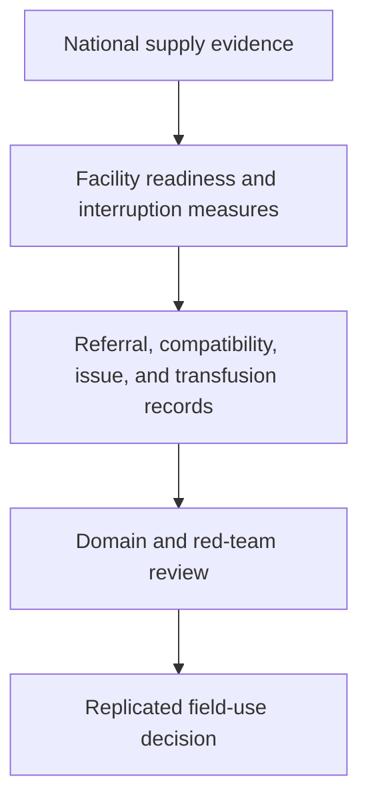
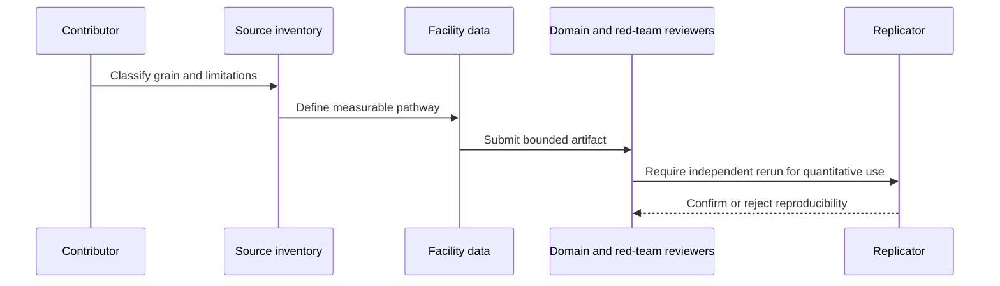

# Health Systems Packs

## Overview

Health-systems packs must separate national policy or supply indicators from facility-level service performance. Blood availability is a high-safety example: readiness, stock interruption, referral delay, compatibility, issue, and transfusion are different measurements.

## Key Components

- Pack-local `problem.json` and `problem.md`: decision, scope, and non-use boundaries.
- Pack-local `tasks.json`: staged roles, reviewer routing, and safety risk.
- Pack-local `evidence.json` and `datasets.md`: source grain, indicator definitions, and provenance.
- Pack-local `validation.md`, `outputs.md`, and `playbooks.md`: replication and field-use gates.

## Diagrams (Mermaid)

### Flowchart

### Component Diagram

### Sequence Diagram

