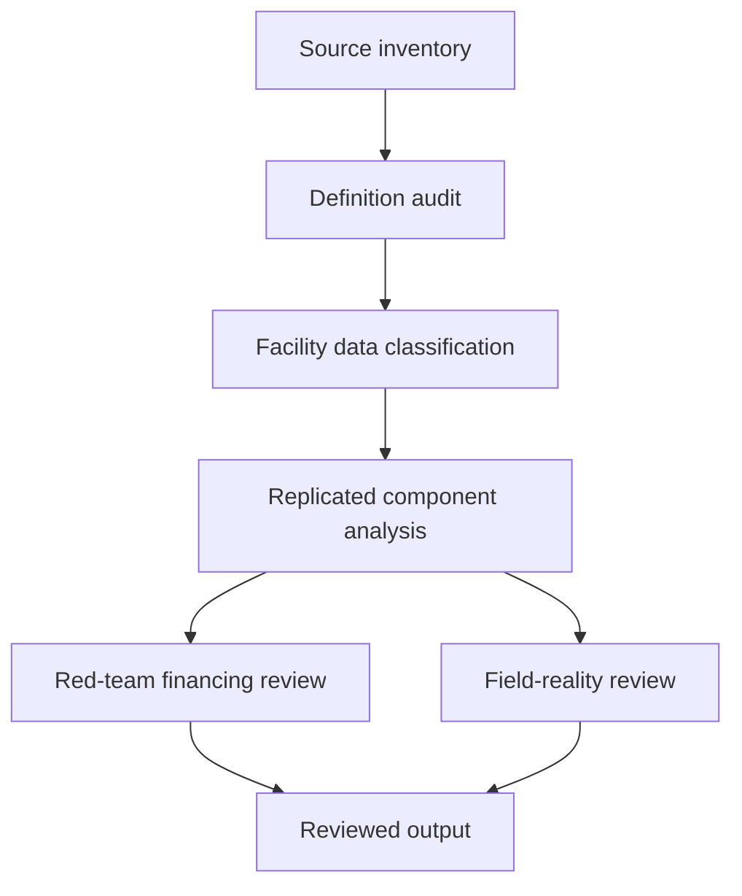

# Task Map

## Active Work Claims

The machine-readable task list is `tasks.json`.

## Work Sequence

## Merge Discipline

Evidence and definitions precede calculations. Calculations precede financing or field interpretations. No equipment, facility, or country ranking is canonical without independent replication and the required high-risk reviews.
