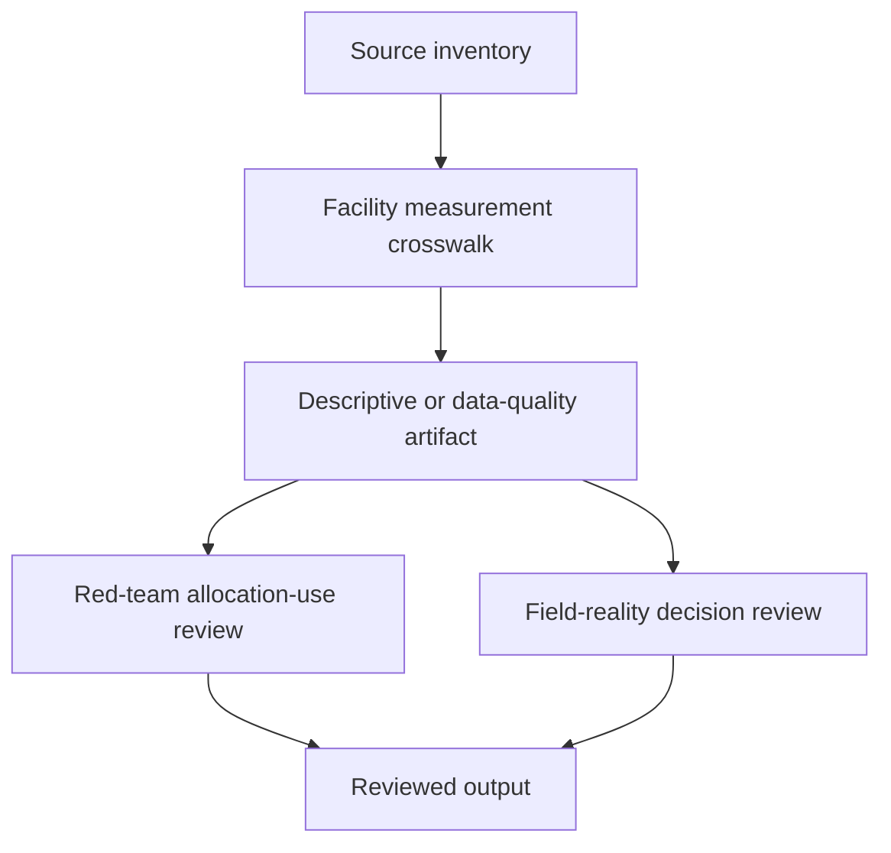

# Task Map

## Active Work Claims

The machine-readable task list is `tasks.json`.

## Work Sequence

## Merge Discipline

Work may happen in parallel, but accepted outputs must preserve this order:

1. Evidence before comparison.
2. Measurement definition before aggregation.
3. Facility-level validation before allocation interpretation.
4. Red-team review before any high-risk output.
5. Replication before clinical or resource-allocation use.
