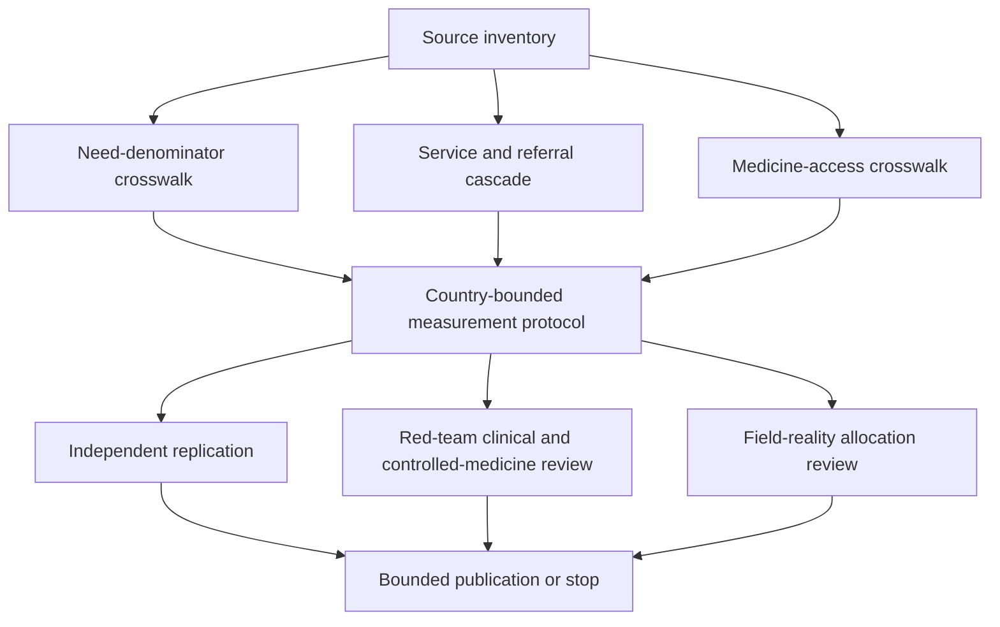

# Task Map

## Active Work Claim

The machine-readable task list is `tasks.json`. `source-inventory` is submitted for review; all downstream tasks remain blocked until its source boundaries are reviewed.

## Work Sequence

## Merge Discipline

1. Source identity and evidence boundaries come before any cross-country comparison.
2. Need definitions, population frames, and missingness rules come before a gap estimate.
3. Service availability, readiness, referral, first contact, continuity, and transfer remain separate fields.
4. Medicine authorization, procurement, availability, affordability, dispensing, and consumption remain separate fields.
5. Patient and caregiver preferences, goals, complaints, and outcomes require consent and must not be inferred from provider activity.
6. Independent replication, red-team review, and field-reality review are required before an allocation-facing or operational output.
