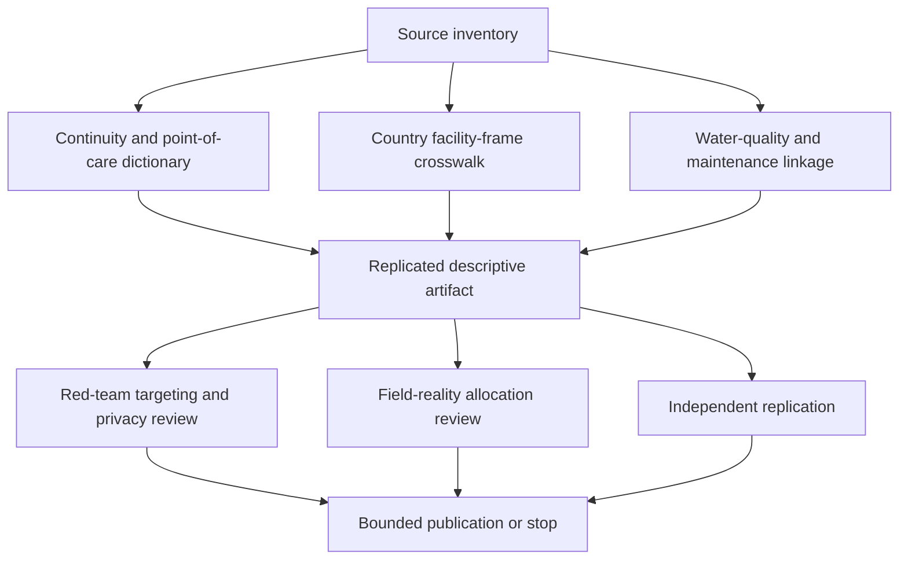

# Task Map

## Active Work Claim

The machine-readable task list is `tasks.json`. `source-inventory` is the only scoped entry task; all downstream work remains blocked until source identity, facility-frame, point-of-care, continuity, quality, and missingness boundaries are reviewed.

## Work Sequence

## Merge Discipline

1. Facility-frame and source identity come before any coverage comparison.
2. Static source presence remains separate from availability when needed, quantity, quality, storage, pump function, supplies, stock-out, and repair.
3. Point-of-care observation is not a facility-wide uptime measure.
4. Facility records are not population access, patient experience, infection, mortality, or quality-of-care outcomes.
5. Missing, refused, not observed, inaccessible, and not-applicable states remain distinct.
6. A source inventory may produce a negative result; no compatible join is better than a fabricated composite score.
7. Domain, red-team, field-reality, and independent replication gates are required before any operational or allocation-facing output.
