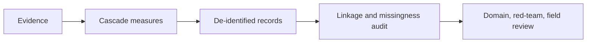
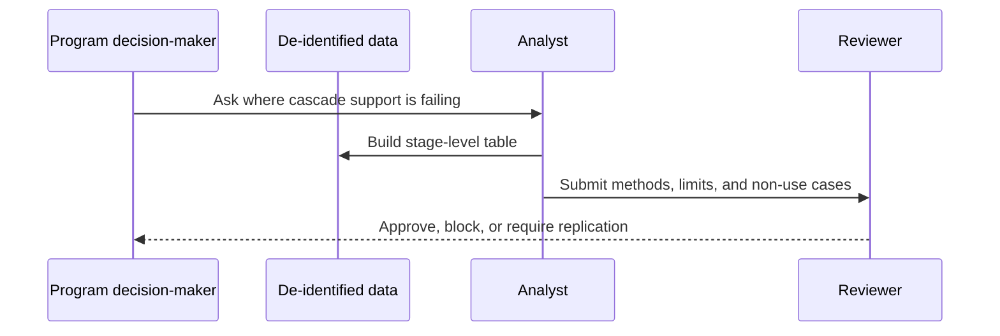

# Congenital Chagas Cascade Pack

## Overview

This pack measures completion of the maternal-newborn Chagas prevention cascade. It does not provide diagnosis or treatment advice.

## Key Components

- `problem.json`: scope, safety level, canonical files, and review gate.
- `evidence.json`: dated source records with claim grain and limitations.
- `datasets.md`: source-family and measurement boundaries.
- `tasks.json`: one scoped literature-scout task followed by staged analysis and review tasks.

## Diagrams

