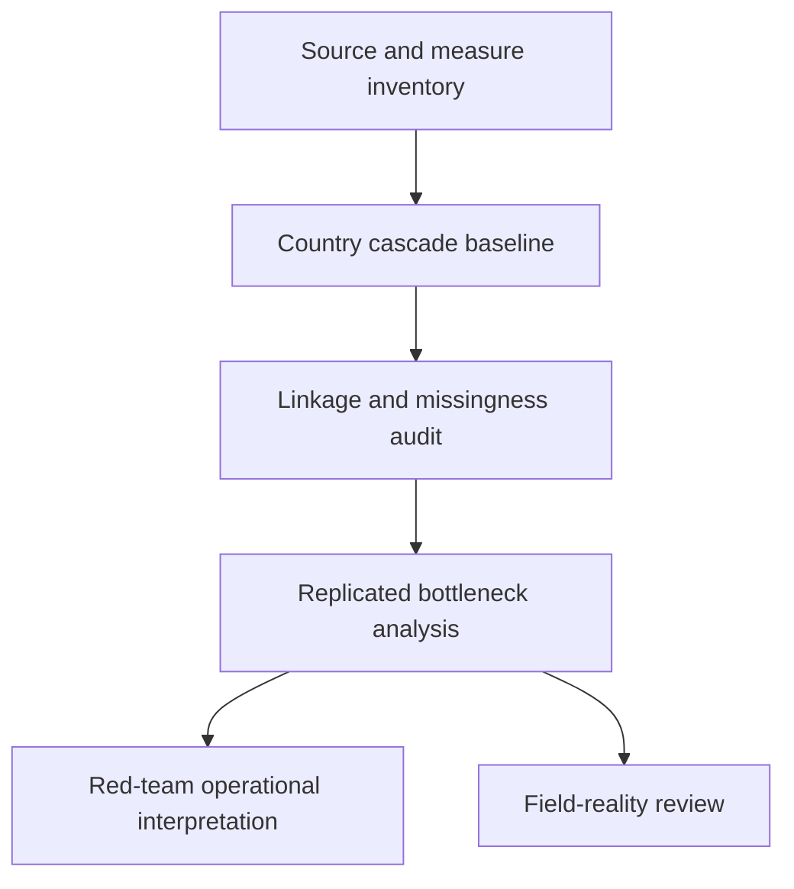

# Task Map

## Work Sequence

## Merge Discipline

1. Evidence before measurement.
2. Measure dictionary before linkage.
3. Linkage audit before performance estimates.
4. Replication before allocation-facing claims.
5. Red-team and field-reality review before publication.
