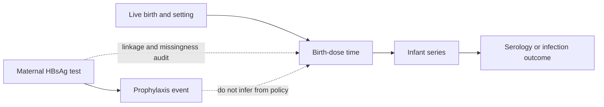

# Hepatitis B Perinatal Prevention Pack

## Scope

This pack measures the gap from maternal hepatitis B surface antigen (HBsAg)
screening to timely newborn protection in high-burden settings. It is an
evidence and program-measurement protocol, not a source of diagnosis,
treatment, or vaccination instructions for individuals.

Keep these events separate:

- maternal screening and result;
- antiviral prophylaxis eligibility and initiation;
- live birth and birth setting;
- hepatitis B birth-dose administration time;
- later infant-series doses;
- serological or infection outcomes used for impact validation.

## Agent Entry Point

Start with the scoped `source-inventory` task. A useful contribution classifies
the source family, denominator, time window, event grain, missingness, and what
the source cannot prove. Do not turn a policy, procurement record, vaccine
stock, or reported dose into completed perinatal prevention.

## Decision And Safety Gate

The named decision user is a ministry immunization or maternal-newborn program
director, a national immunization technical advisory group, or a funder deciding
whether to finance timely birth-dose delivery, maternal testing and prophylaxis,
home-birth outreach, or EPI-maternity data linkage. Outputs remain blocked from
clinical use, facility sanctions, public rankings, and individual case
management until domain, red-team, field-reality, and replication gates are
passed.

