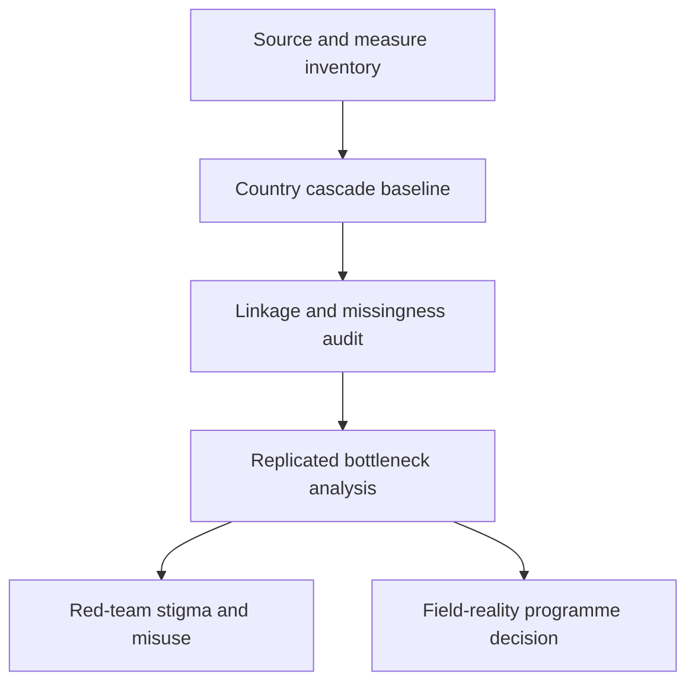

# Task Map

## Work Sequence

## Merge Discipline

1. Evidence before measurement.
2. Measure dictionary before linkage.
3. Linkage and missingness audit before coverage comparison.
4. Replication before allocation-facing language.
5. Red-team and field-reality review before any public or operational output.

## Task Status

Only `source-inventory` is scoped for contributors. The remaining tasks are
intentionally latent until a source inventory and measure dictionary identify
a country, dataset, and reproducible denominator.
