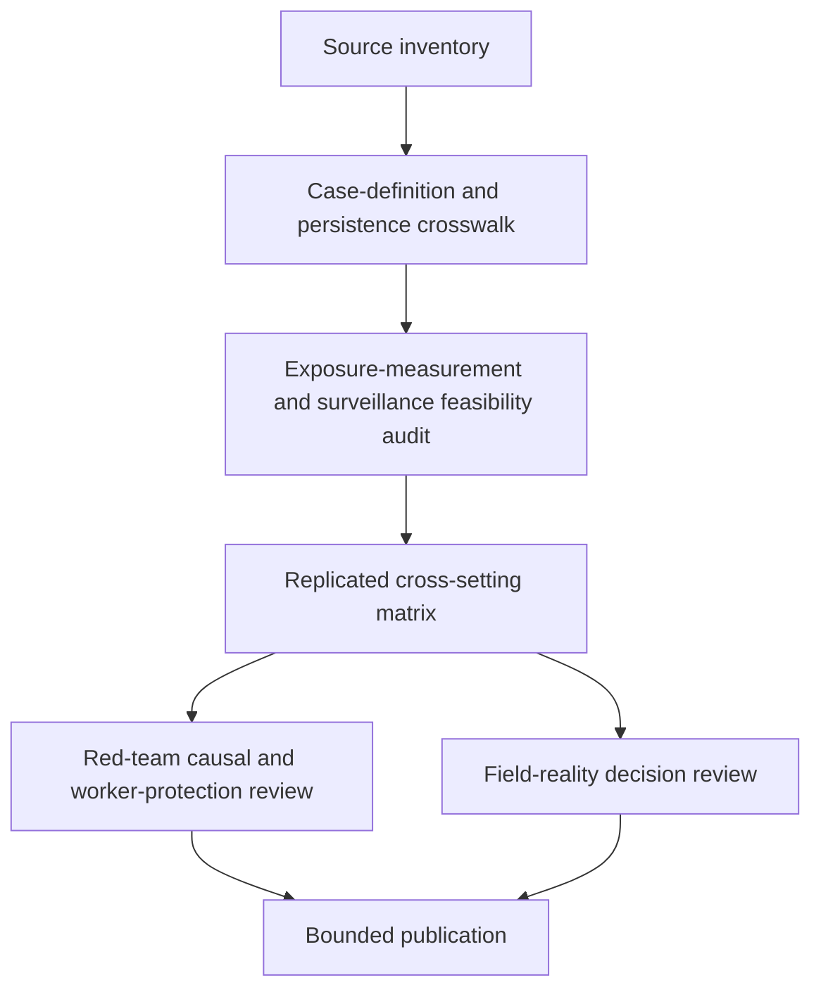

# Task Map

## Active Work Claims

The machine-readable task list is `tasks.json`.

## Work Sequence

## Merge Discipline

Work may happen in parallel, but accepted outputs must preserve this order:

1. Evidence and source identity before case-definition harmonization.
2. Persistence, phenotype, and denominator rules before prevalence comparison.
3. Objective exposure and missingness documentation before causal interpretation.
4. Independent replication before any quantitative or field-facing output.
5. Red-team and field-reality review before publication beyond analytic framing.
