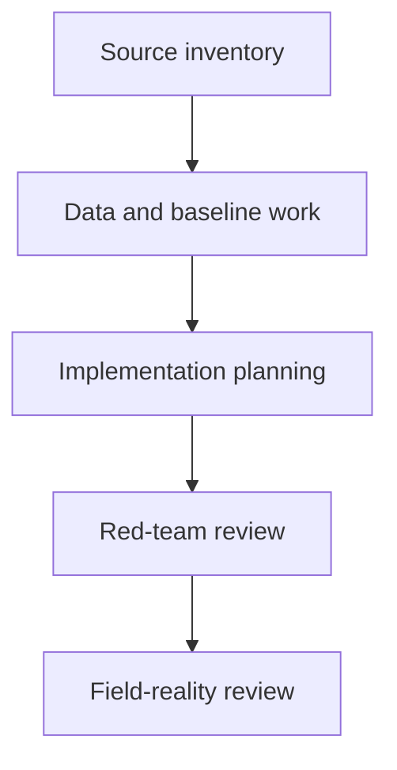
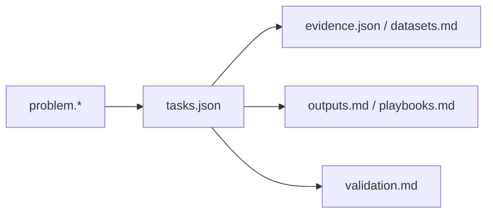
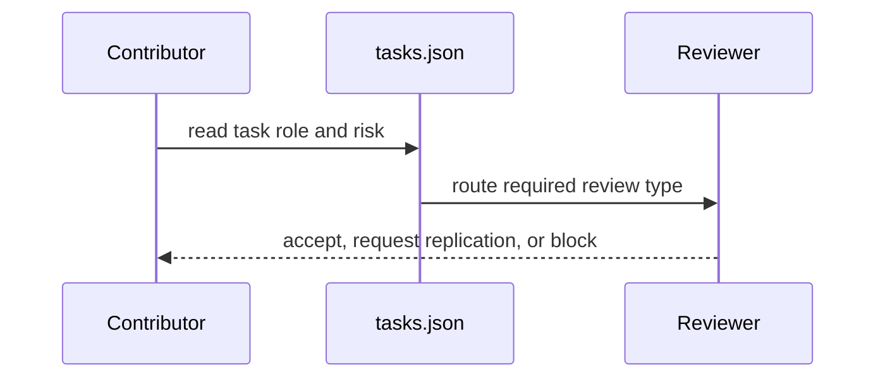

# Public Health Packs

## Overview

Public-health packs require explicit separation between evidence inventory, analysis, and any field-facing implication. Metadata drift here is a safety defect, not a cosmetic issue.

## Key Components

- Pack-local `problem.json` and `problem.md`: health problem framing and merge gates.
- Pack-local `tasks.json`: owner-role sequencing, reviewer routing, and risk labels.
- Pack-local `evidence.json`, `datasets.md`, `outputs.md`, `playbooks.md`: canonical evidence and downstream use constraints.
- `long-distance-elder-care-vietnam/`: separates distant-family notification from verified local reach, resolution, and clinical outcome.

## Diagrams (Mermaid)

### Flowchart

### Component Diagram

### Sequence Diagram

