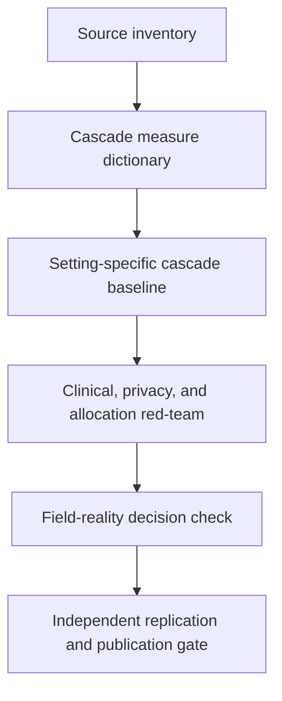

# Task map

| Task                                  | Role                   | Status       | Output                                            | Gate                   |
| ------------------------------------- | ---------------------- | ------------ | ------------------------------------------------- | ---------------------- |
| `source-inventory`                    | Literature Scout       | Needs review | Dated source classification plus evidence records | Domain review          |
| `cascade-measure-dictionary`          | Data Cleaner           | Needs triage | Stage definitions and denominator rules           | Replicator             |
| `cascade-baseline`                    | Implementation Planner | Needs triage | Reproducible setting-specific baseline            | Replicator             |
| `red-team-clinical-allocation-misuse` | Red-Team Reviewer      | Needs triage | Failure-mode review and publication blocks        | Field-reality reviewer |
| `field-reality-decision-check`        | Field-Reality Reviewer | Needs triage | Named user, decision, timing, and non-use cases   | Red-team reviewer      |

The sequence is deliberate. No model, forecast, or allocation recommendation should be attempted before source identity, denominator, and event grain are reviewed.
