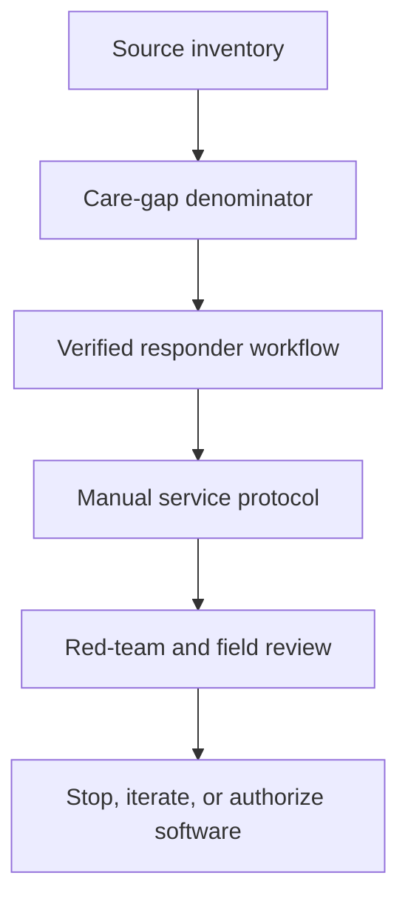
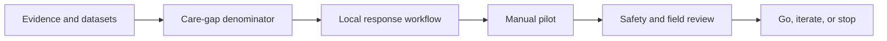
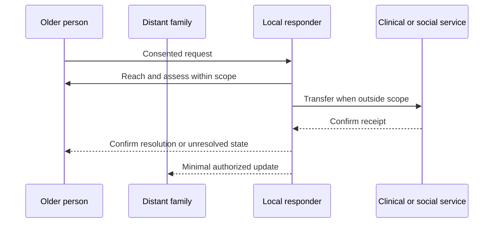

# Long-Distance Elder Care In Viet Nam

## Overview

This pack investigates whether older people with distant family lack timely local response. Keep monitoring, acknowledgement, physical reach, resolution, transfer, and clinical outcome as separate states.

## Key Components

- `evidence.json` and `datasets.md`: source claims and the incompatible measure families behind the care-gap denominator.
- `tasks.json` and `task-map.md`: evidence-to-field sequencing and review ownership.
- `playbooks.md`: the canonical master plan, manual-service gate, disconfirming tests, trade-offs, and software authorization rule.
- `playbooks-vietnamese.md`: the Vietnamese operational translation. Keep it aligned with `playbooks.md`; it does not replace the canonical plan.
- `validation.md`: denominator, event-state, consent, safeguarding, and prohibited-claim gates.
- `outputs.md`: candidate artifacts and mandatory non-use language.

## Diagrams (Mermaid)

### Flowchart

### Component Diagram

### Sequence Diagram

