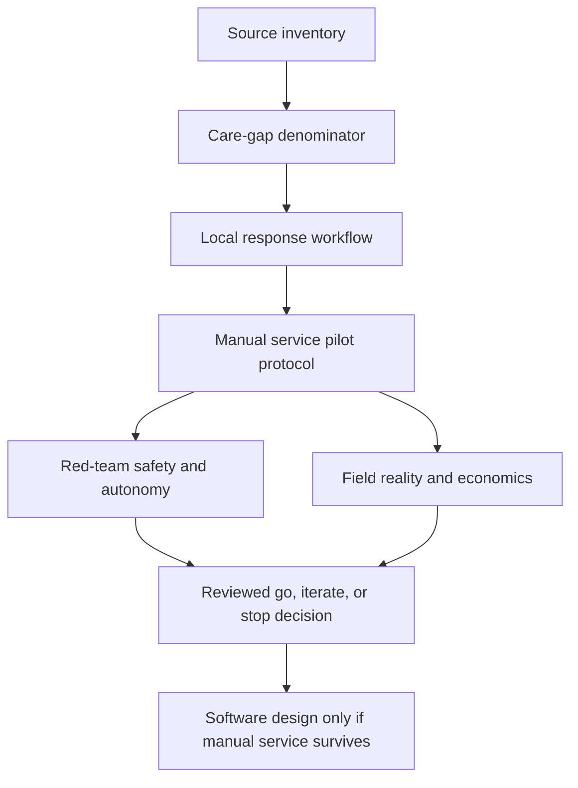
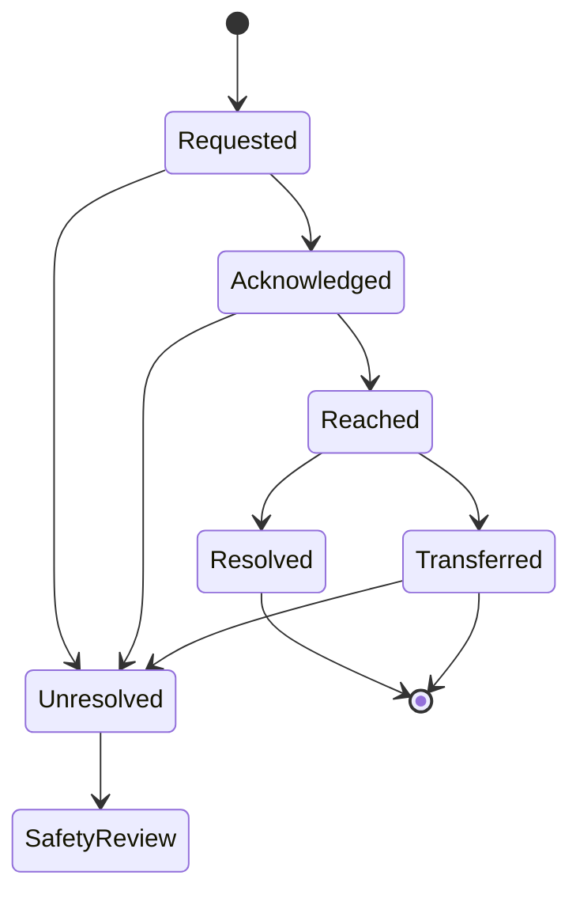

# Task Map

## Active Work Claim

The machine-readable task list is `tasks.json`. Only `source-inventory` is currently scoped.

## Work Sequence

## State Machine

## Merge Discipline

1. Evidence before denominator.
2. Denominator before market size.
3. Verified responders before alerts.
4. Manual service before software.
5. Operational reliability before clinical claims.
6. Red-team, field-reality, and replication review before field use.
