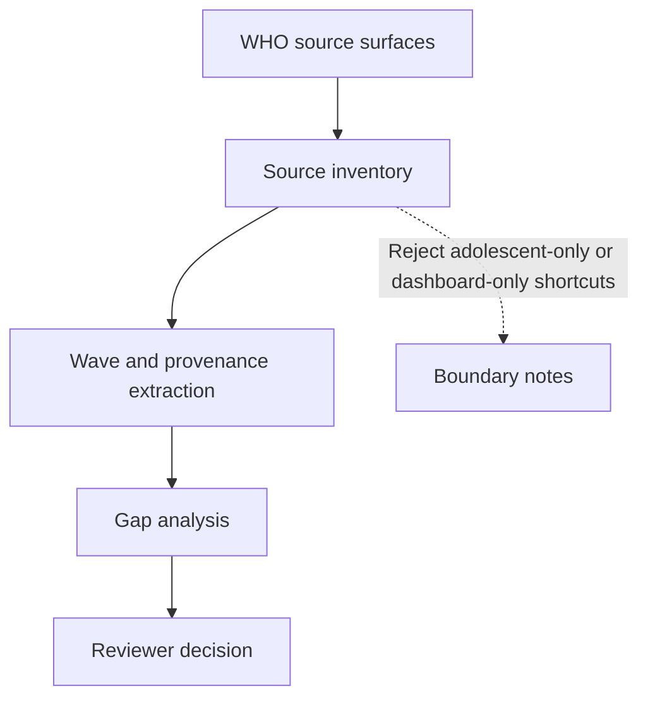
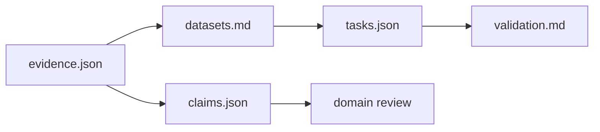
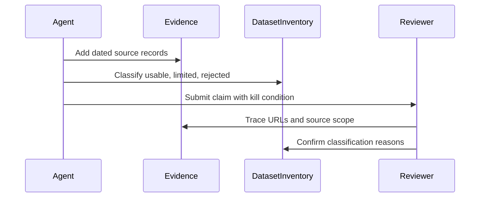

# NCD Risk Factor Surveillance Pack

## Overview

This pack is about evidence readiness, not NCD burden ranking. The first-order question is whether public source surfaces can prove recent measured adult risk-factor surveillance by country and, later, by sub-national unit.

Do not treat a dashboard indicator as survey evidence unless it traces back to a source-level record with wave date, population, measured-versus-modeled provenance, access status, and geographic grain.

## Key Components

- `problem.json` and `problem.md`: scope and decision wedge.
- `evidence.json` and `evidence.md`: canonical source-family evidence.
- `datasets.md`: usable, limited, and rejected source classifications.
- `claims.json`: current falsifiable source-fragmentation claim.
- `tasks.json` and `task-map.md`: work queue and dependency order.
- `validation.md`: merge and replication gates.

## Diagrams

### Flowchart

### Component Diagram

### Sequence Diagram

