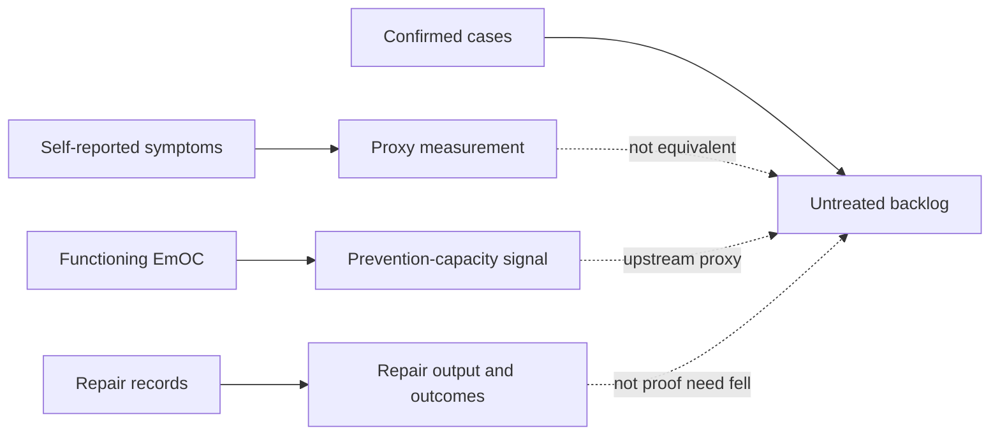
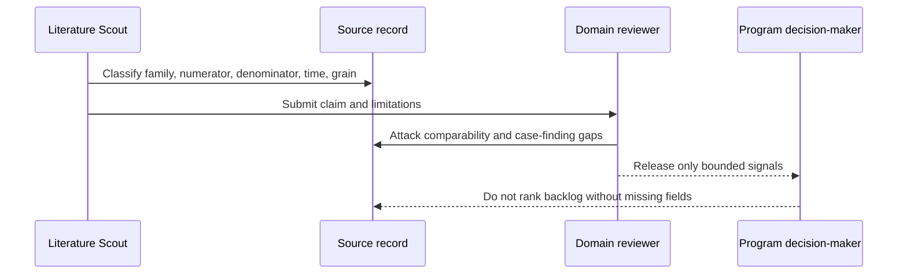

# Obstetric Fistula Repair Access Pack

## Overview

This pack separates untreated prevalent fistula, incident prevention failure, repair output, repair outcomes, and self-reported symptoms. Evidence must identify its measurement family before it is used in an allocation argument.

## Key Components

- `problem.md`: bounded allocation question, scope, and prohibited uses.
- `evidence.json` and `evidence.md`: dated source records with claims and limitations.
- `datasets.md`: source inventory with numerator, denominator, time, grain, and case-finding boundaries.
- `tasks.json`: staged source-inventory, reconciliation, feasibility, red-team, and field-reality work.
- `validation.md`: comparison, replication, and allocation-signal gates.

## Diagrams (Mermaid)

### Measurement flow

### Allocation review sequence

