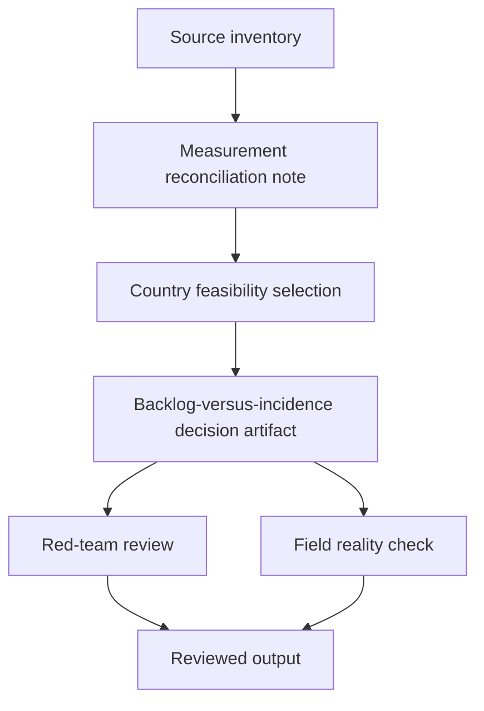

# Task Map

## Active Work Claims

The machine-readable task list is `tasks.json`.

## Work Sequence

## Merge Discipline

1. Source-family inventory before country selection.
2. Measurement reconciliation before any comparison.
3. Country feasibility before any ranking.
4. Red-team and field-reality review before publication.
