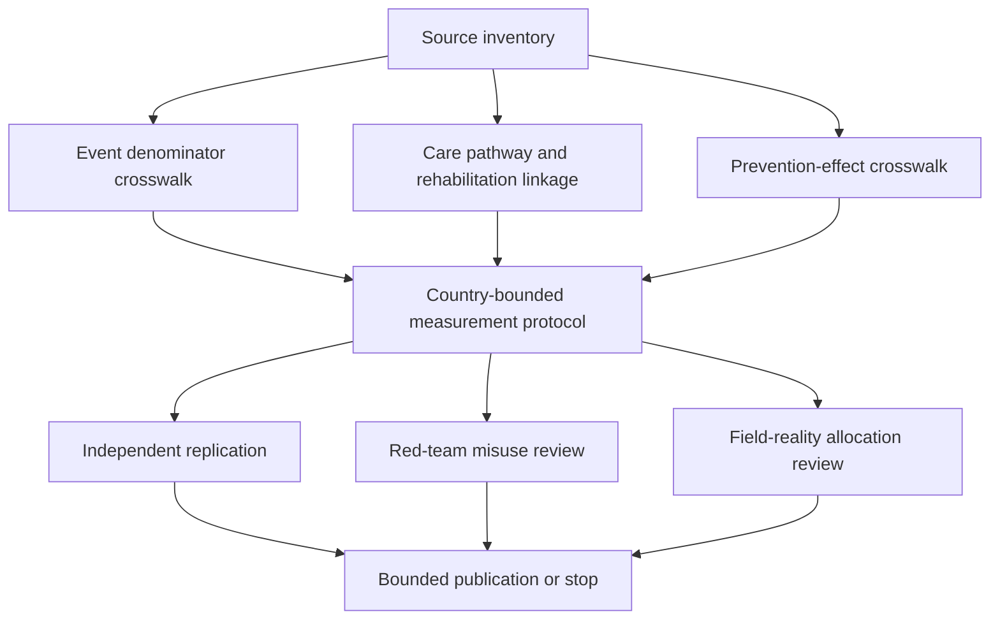

# Task Map

## Active Work Claim

The machine-readable task list is `tasks.json`. `source-inventory` is the first scoped task; all downstream tasks remain blocked until the event and care-pathway source boundaries are reviewed.

## Work Sequence

## Merge Discipline

1. Source identity, case definitions, and sampling frames come before prevalence comparison.
2. Population fall events remain separate from facility presentations, injury severity, and mortality.
3. Time-to-care fields must state the exact start and end event; arrival time is not automatically transport time.
4. Prevention exposure, intervention fidelity, fall recurrence, injury, and functional recovery remain distinct outcomes.
5. Risk-factor associations do not become causal explanations, individual scores, or care-denial rules.
6. Independent replication, injury/healthy-ageing domain review, red-team review, and field-reality review are required before operational or allocation-facing output.
