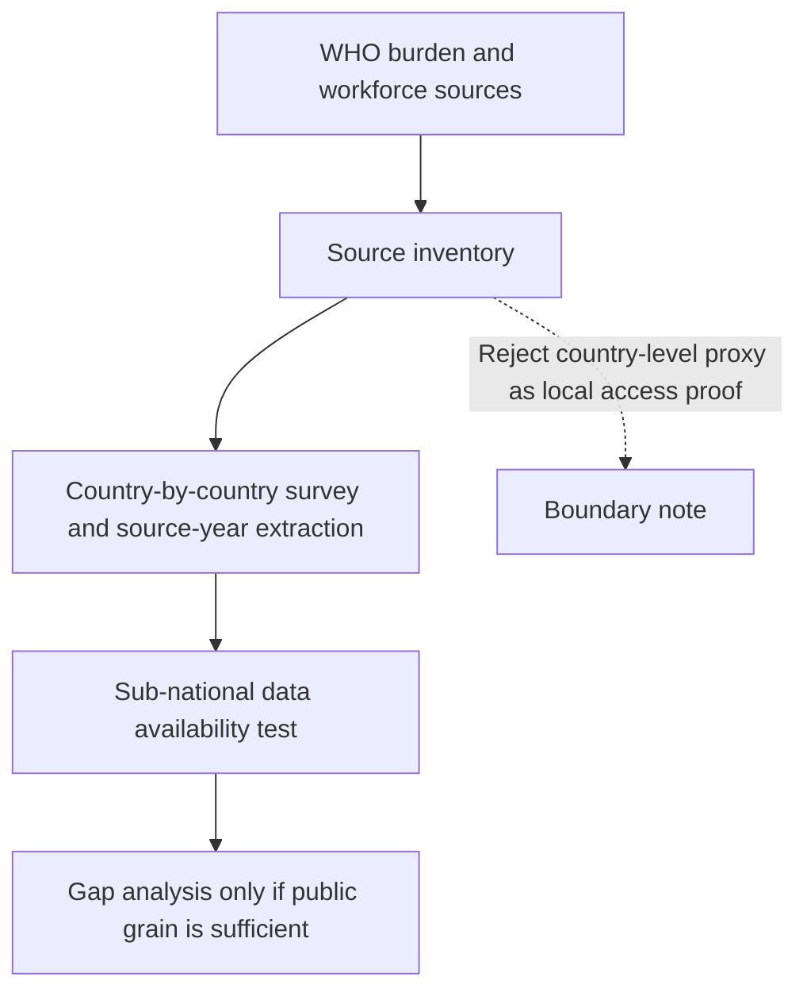
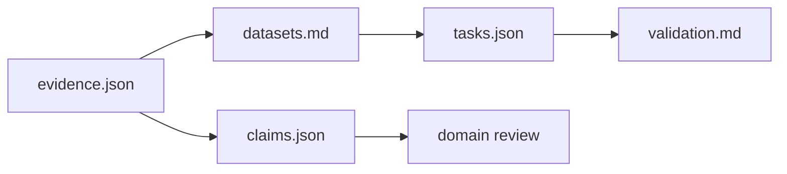
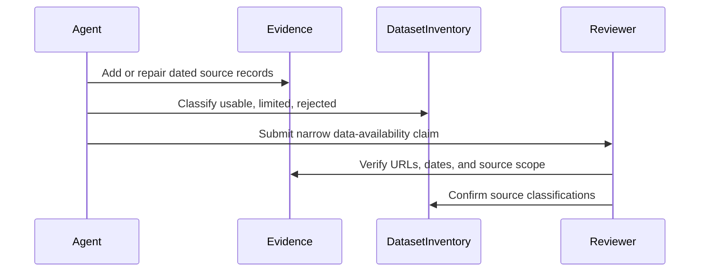

# Oral Health Access Pack

## Overview

This pack is about evidence readiness for oral health access, not oral disease advocacy. The useful question is whether public sources can support sub-national service-access or workforce-gap analysis in low-income countries without pretending that country-level burden estimates are facility or district data.

Do not treat a WHO burden fact, a dentist-density country indicator, or a general health-spending denominator as proof of local access. Those sources frame the problem; they do not locate the bottleneck.

## Key Components

- `problem.json` and `problem.md`: scope, decision wedge, and baseline facts.
- `evidence.json` and `evidence.md`: dated source-family records and source-use notes.
- `datasets.md`: usable, limited, and rejected source classifications.
- `claims.json`: current falsifiable data-scarcity claim.
- `tasks.json` and `task-map.md`: work queue and dependency order.
- `validation.md`: validation, review, and replication gates.

## Diagrams

### Flowchart

### Component Diagram

### Sequence Diagram

