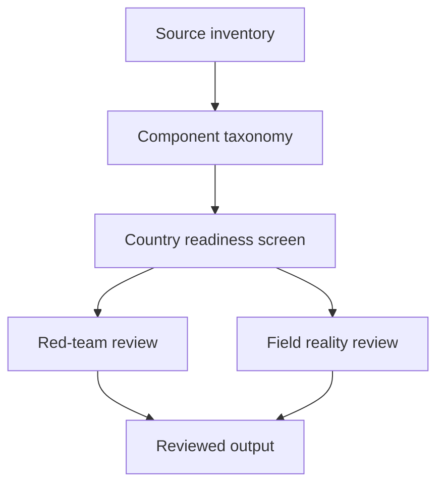
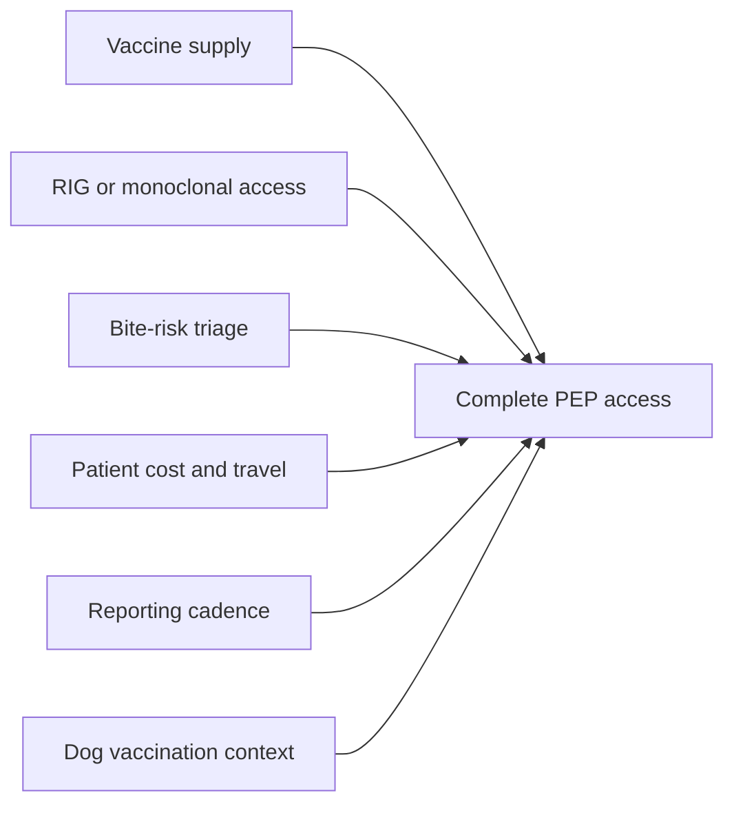
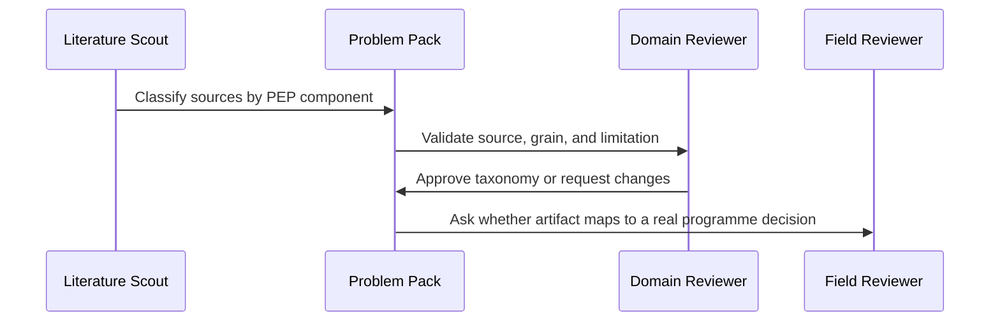

# Rabies PEP Access Pack

## Overview

This pack studies evidence for complete rabies post-exposure prophylaxis access in endemic settings. The core distinction is vaccine procurement versus complete PEP access.

## Key Components

- `problem.json`: pack metadata and review policy.
- `evidence.json`: dated evidence records.
- `datasets.md`: source inventory and source limitations.
- `tasks.json`: scoped task map.
- `validation.md`: component-separation and review gates.

## Diagrams

### Flowchart

### Component Diagram

### Sequence Diagram

## Agent Warning

Do not treat vaccine procurement, vaccine doses used, or national rabies deaths as direct proof of complete PEP access. This is the pack's main false-positive path.
