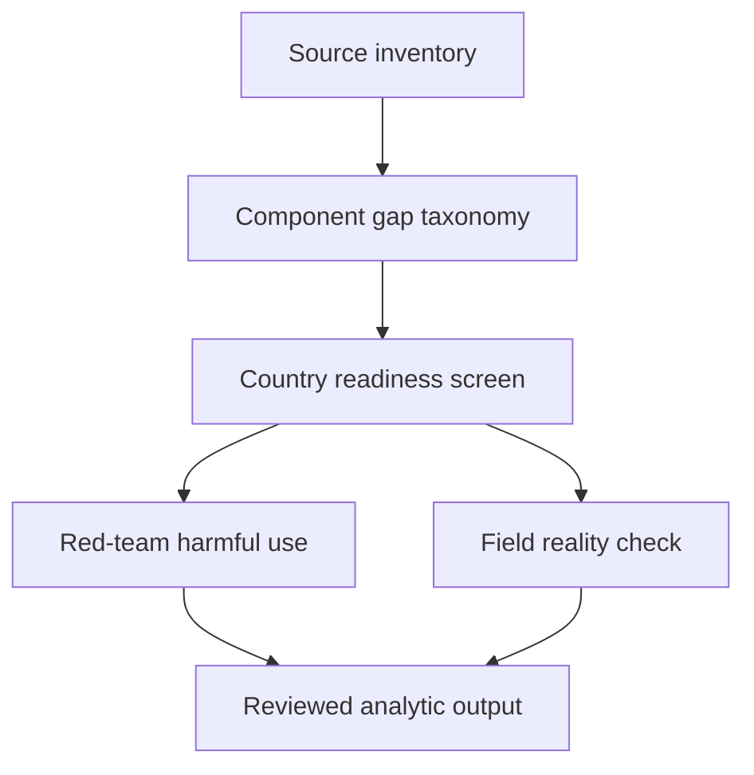

# Task Map

## Active Work Claims

The machine-readable task list is `tasks.json`.

## Work Sequence

## Merge Discipline

1. Source inventory before taxonomy.
2. Component taxonomy before country screening.
3. Country screening before any allocation analysis.
4. Red-team and field-reality review before operational interpretation.

## First Move

`source-inventory` is the only scoped task. It must classify sources by the PEP component they actually measure. A source that proves vaccine procurement does not prove complete PEP access.
