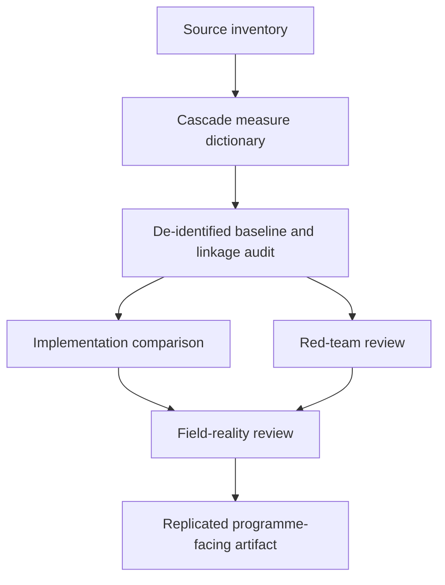

# Task Map

## Active Work Claims

The machine-readable task list is `tasks.json`.

## Work Sequence

## Merge Discipline

Work may happen in parallel, but canonical outputs preserve this order:

1. Evidence before claims.
2. Measure definitions before aggregation.
3. Denominator and missingness audit before comparison.
4. Domain review before clinical or allocation interpretation.
5. Red-team and field-reality review before publication.
6. Independent replication before any quantitative output is treated as accepted knowledge.
