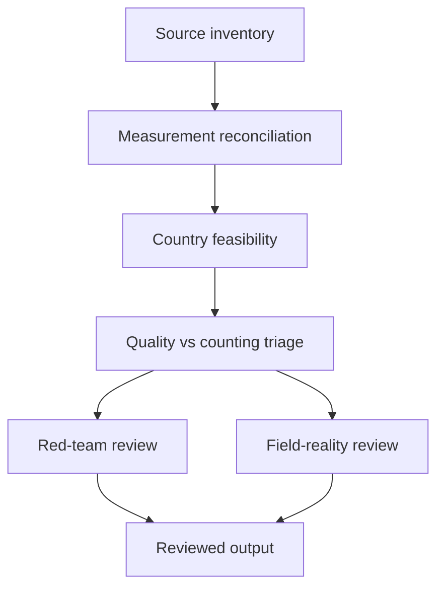
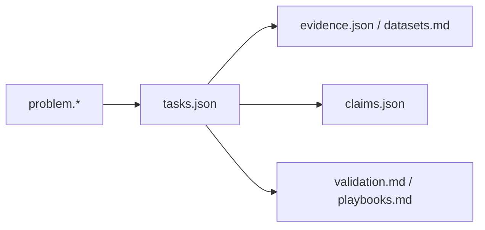
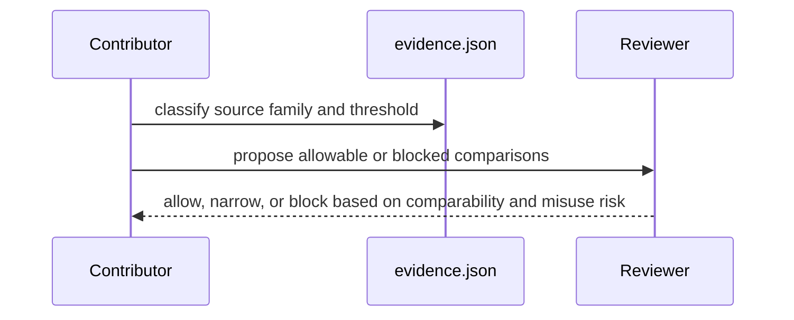

# Stillbirth Measurement Pack

## Overview

This pack exists to stop a common analytical failure: treating stillbirth burden, stillbirth registration, and facility stillbirth counts as if they were one indicator.

Intrapartum stillbirth is the policy wedge here only when the workflow is named. "Maternal care is weak" is too vague to merge.

## Key Components

- `problem.*`: scope, neglected wedge, and merge gate.
- `tasks.json`: sequencing from source inventory to comparison discipline and follow-on triage.
- `evidence.json` and `datasets.md`: burden anchors and source inventory.
- `claims.json`: persistent claims with kill conditions.
- `validation.md` and `playbooks.md`: what is blocked, what can be compared, and how misuse is prevented.

## Diagrams (Mermaid)

### Flowchart

### Component Diagram

### Sequence Diagram

