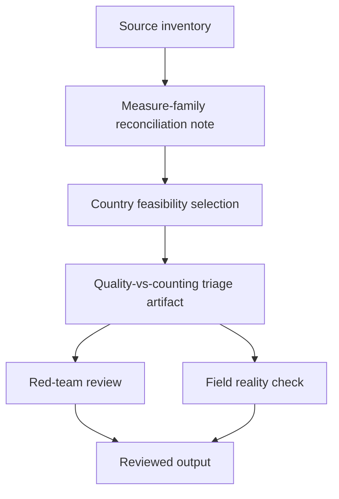

# Task Map

## Active Work Claims

The machine-readable task list is `tasks.json`.

## Work Sequence

## Merge Discipline

1. Burden framing before country choice.
2. Definition reconciliation before comparison.
3. Country feasibility before any ranking.
4. Red-team and field-reality review before publication.
