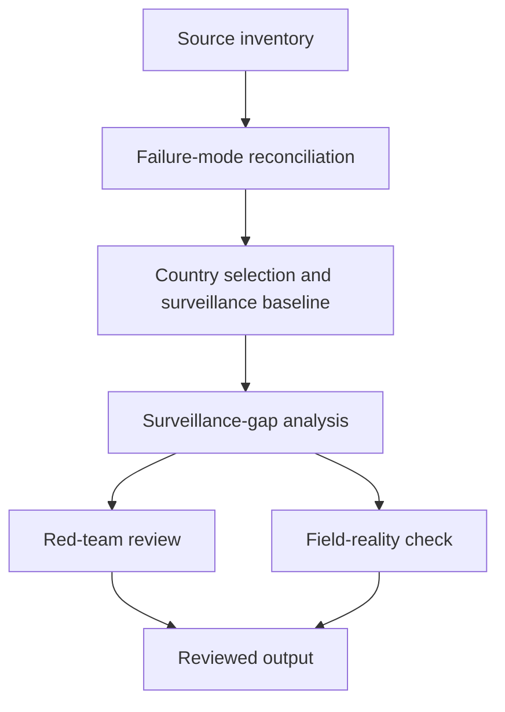

# Task Map

## Active Work Claims

The machine-readable task list is `tasks.json`.

## Work Sequence

## Merge Discipline

Work may happen in parallel, but accepted outputs must preserve this order:

1. Evidence before model.
2. Failure-mode definitions before surveillance-gap analysis.
3. Country selection before sub-national mapping.
4. Surveillance-gap analysis before procurement-facing claims.
5. Red-team review before any field-facing output.
6. Field-reality review before publication.
