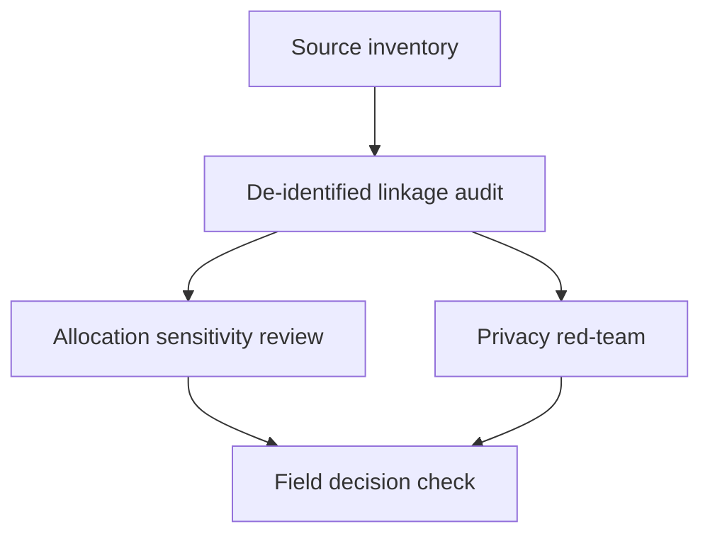

# Task Map

## Active Work Claims

The machine-readable task list is `tasks.json`.

## Work Sequence

## Merge Discipline

1. Evidence before linkage.
2. De-identification and source reconciliation before ranking.
3. Sensitivity analysis before any allocation discussion.
4. Red-team review before field-facing output.
5. No output is an enforcement order, engineering design, or causal effect estimate without separate review and replication.
