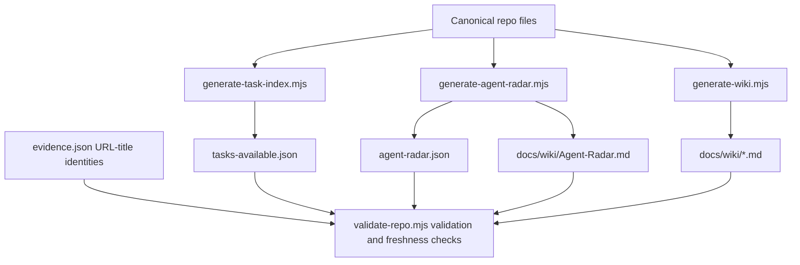
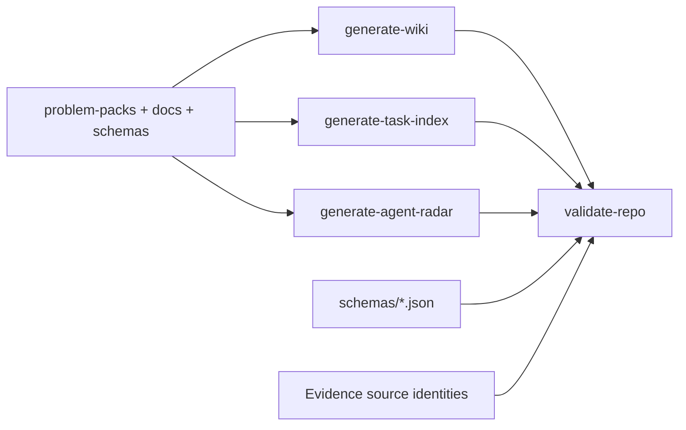
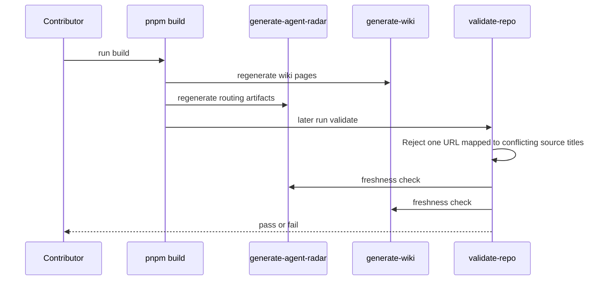

# Scripts Module

## Overview

This directory contains deterministic repository automation. Scripts here generate canonical derived artifacts or enforce merge gates. Keep them side-effect-light, file-system local, and fully reproducible from repo state.

## Key Components

- `generate-wiki.mjs`: regenerates the reader-facing wiki pages from canonical repo files.
- `generate-task-index.mjs`: emits `tasks-available.json` from scoped tasks.
- `generate-agent-radar.mjs`: emits `agent-radar.json` and `docs/wiki/Agent-Radar.md` from live task metadata.
- `validate-repo.mjs`: enforces schema, evidence-source identity, link, freshness, and formatting checks.
- `check-reproducibility.mjs`: checks that task-map and artifact expectations remain coherent.
- `verify-sources.mjs`: verifies live evidence URLs, retrying one transient GET timeout or retryable HTTP status.
- `lib/files.mjs`: shared root/path helpers.

## Diagrams (Mermaid)

### Flowchart

### Component Diagram

### Sequence Diagram

